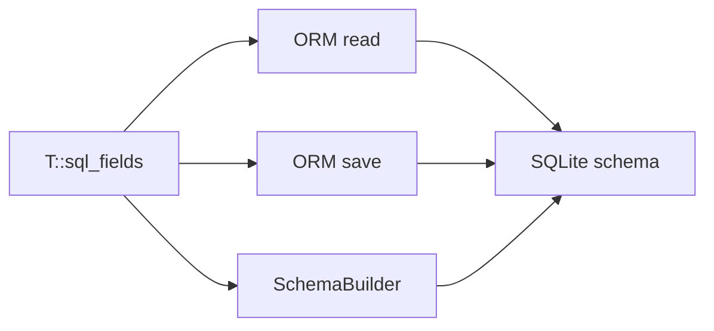

# Schema generation

Ligarium can generate a SQLite schema directly from the metadata declared by application records.

The schema generator uses the same `T::sql_fields()` metadata as the ORM itself. This keeps the database structure and the C++ record definition synchronized.

## Basic usage

Include the schema header:

```cpp
#include <schema.h>
```

Open a SQLite connection:

```cpp
QSqlDatabase connection =
    QSqlDatabase::addDatabase("QSQLITE");

connection.setDatabaseName("application.db");

if (!connection.open()) {
    // Handle the connection error.
}
```

Create a schema builder:

```cpp
Ligarium::SchemaBuilder schema(connection);
```

Then create the tables for the application's records:

```cpp
if (!schema.create_all<Property, Tenant, Attachment>()) {
    qFatal(
        "Failed to create schema: %s",
        qPrintable(schema.last_error()));
}
```

`create_all()` performs the operation in two phases:

1. Create all record tables.
2. Create the relationship structures.

This allows records to reference tables that are created in the same operation.

---

## Record metadata

A record exposes its database metadata through `T::sql_fields()`.

For example:

```cpp
class Property : public Ligarium::Record<Property>
{
public:
    static constexpr Ligarium::Table static_table =
        ApplicationTable::Property;

    QString name;

    Property(Ligarium::Database* db = nullptr)
        : Record(db)
    {
    }

    static constexpr auto sql_fields()
    {
        return std::tuple{
            Ligarium::field(
                u"name",
                &Property::name),
        };
    }
};
```

The return type of `sql_fields()` is a `std::tuple` containing Ligarium field metadata:

```cpp
std::tuple<
    Ligarium::SqlField<Property, QString>
>
```

The schema generator inspects this tuple at compile time.

---

## Generated record tables

Every record table receives an `id` column:

```sql
"id" INTEGER PRIMARY KEY AUTOINCREMENT
```

Regular fields are mapped according to their C++ type.

For example:

```cpp
static constexpr auto sql_fields()
{
    return std::tuple{
        Ligarium::field(u"name", &Property::name),
        Ligarium::field(u"area", &Property::area),
        Ligarium::field(u"active", &Property::active),
    };
}
```

generates columns equivalent to:

```sql
"name"   TEXT,
"area"   REAL,
"active" INTEGER
```

The current default mappings are:

| C++ type             | SQLite type |
| -------------------- | ----------- |
| `bool`               | `INTEGER`   |
| integral types       | `INTEGER`   |
| floating-point types | `REAL`      |
| `QString`            | `TEXT`      |
| `QByteArray`         | `BLOB`      |
| `QDate`              | `TEXT`      |
| `QDateTime`          | `TEXT`      |

The schema generator does not infer constraints that are not explicitly represented by the field metadata.

In particular, it does not automatically add:

* `NOT NULL`
* `DEFAULT`
* `UNIQUE`
* `CHECK`
* foreign-key constraints

These can be introduced later if the field metadata is extended to describe them.

---

## Scalar relationships

`OneToOne` and `ManyToOne` relationships are stored as foreign-key IDs in the owner table.

For example:

```cpp
Ligarium::link_ManyToOne(
    u"tenant_id",
    &Property::tenant)
```

generates:

```sql
"tenant_id" INTEGER
```

The relationship metadata identifies the column, while the linked record ID is stored in that column.

The schema generator does not currently add an SQL `FOREIGN KEY` constraint. Referential behavior remains managed by Ligarium.

---

## One-to-many relationships

A `OneToMany` relationship stores the foreign key in the target table.

For example:

```cpp
Ligarium::link_OneToMany(
    u"properties",
    &Tenant::properties,
    ApplicationTable::Property,
    u"tenant_id")
```

means that the `Property` table receives:

```sql
"tenant_id" INTEGER
```

The relationship is therefore represented as:

```text
Tenant
  │
  └── properties
          │
          ▼
      Property
      tenant_id
```

The owner table does not receive a column for the collection itself.

---

## Many-to-many relationships

A `ManyToMany` relationship is stored in an association table.

For example:

```cpp
Ligarium::link_ManyToMany(
    u"attachments",
    &Property::attachments,
    ApplicationTable::PropertyAttachment,
    u"property_id",
    u"attachment_id")
```

generates an association table equivalent to:

```sql
CREATE TABLE "PropertyAttachment" (
    "property_id" INTEGER NOT NULL,
    "attachment_id" INTEGER NOT NULL,
    PRIMARY KEY ("property_id", "attachment_id")
);
```

The primary key prevents the same pair from being inserted more than once.

The association table is identified explicitly by the application table enum:

```cpp
ApplicationTable::PropertyAttachment
```

---

## Polymorphic relationships

A polymorphic `OneToMany` relationship associates a target record with a record whose table can vary.

For example:

```cpp
Ligarium::link_PolymorphicOneToMany(
    u"attachments",
    &Property::attachments,
    ApplicationTable::Attachment)
```

The target table receives two columns:

```sql
"owner_table" TEXT,
"owner_id" INTEGER
```

For example:

```text
id | filename       | owner_table | owner_id
---+----------------+-------------+---------
1  | floorplan.pdf  | Property    | 42
2  | photo.jpg      | Property    | 42
3  | contract.pdf   | Tenant      | 7
```

The pair:

```text
owner_table = "Property"
owner_id    = 42
```

identifies the owner record:

```text
Property #42
```

### Primary key convention

`owner_id` always refers to the primary key of the owner record.

Ligarium therefore does not need metadata describing the owner ID column. The primary key column is always:

```sql
"id"
```

The polymorphic relationship only needs to identify the owner's table.

### Table name representation

The value stored in `owner_table` is the string returned by:

```cpp
Ligarium::Table_to_str(table)
```

For example:

```cpp
Table_to_str(ApplicationTable::Property)
```

produces the value stored in `owner_table`.

This avoids storing the numeric value of the application-specific `Table` enum in the database.

---

## SQL identifier quoting

SchemaBuilder quotes SQL identifiers when generating SQL.

For example:

```cpp
ApplicationTable::Attachment
```

may result in:

```sql
"Attachment"
```

and a column such as:

```cpp
u"owner_id"
```

becomes:

```sql
"owner_id"
```

This is important for identifiers that may conflict with SQL keywords.

---

## `create()` versus `create_all()`

`create<T>()` creates the table belonging to a single record:

```cpp
schema.create<Property>();
```

It creates the record table and its fields that are physically stored in that table.

Relationship structures that depend on other tables are handled by `create_all()`.

For a complete schema:

```cpp
schema.create_all<
    Property,
    Tenant,
    Attachment>();
```

The recommended approach is to include all related record types in the call.

---

## In-memory databases

SchemaBuilder works with any open SQLite connection, including an in-memory database.

This is particularly useful for tests:

```cpp
QSqlDatabase connection =
    QSqlDatabase::addDatabase(
        "QSQLITE",
        "ligarium-test");

connection.setDatabaseName(":memory:");

QVERIFY(connection.open());

Ligarium::SchemaBuilder schema(connection);

QVERIFY(
    schema.create_all<
        Property,
        Tenant,
        Attachment>());
```

The same schema generation code is therefore used by both tests and applications.

---

## Error handling

`SchemaBuilder` returns `false` when an SQL operation fails.

The last SQLite error is available through:

```cpp
schema.last_error()
```

Example:

```cpp
if (!schema.create_all<Property, Tenant>()) {
    qWarning()
        << "Schema creation failed:"
        << schema.last_error();
}
```

Applications should check the return value rather than assuming that schema creation succeeded.

---

## Design principle

Schema generation is intentionally based on the record metadata already used by Ligarium:



There is therefore a single source of truth for:

* field names;
* C++ field types;
* scalar relationships;
* collection relationships;
* polymorphic relationships.

The application does not need to maintain a separate hand-written SQL schema for the records handled by Ligarium.
